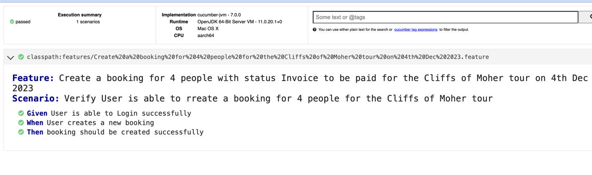

###BDD-Cucumber-Selenium-Java Framework
This repo consists of automated tests for booking of tours using Pax365 software

##Instructions to run the tests
1. Java and maven should be installed on your machine
2. Clone the repo
3. Navigate to the repository in a terminal and run the following commands, in order: mvn clean install
4. Make sure the chrome driver version is same as the chrome browser version
5. If required, update the chromedriver.exe at this path: src/test/java/driver/drivers
6. Run the command to execute test: **mvn -Dtest=runner test** 
7. Open the html report (target/cucumber.html) in browser to verify the results

